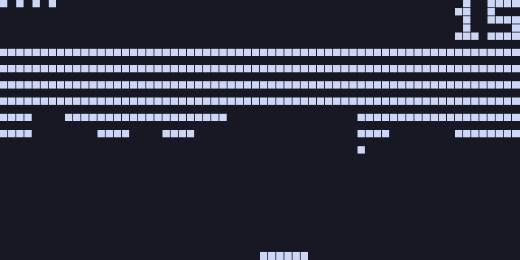
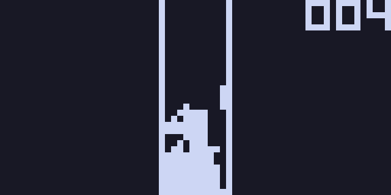
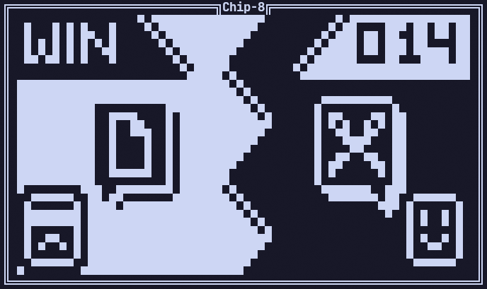

# Chip-8 Emulator

A basic chip-8 emulator / interpreter made in C for GNU/Linux.

## Table of Contents

- [Features](#features)
- [Requirements](#requirements)
- [Build](#build)
- [Usage](#usage)
    - [Inputs](#inputs)
- [Screenshots](#screenshots)
- [Resources](#resources)
- [License](#license)

## Features

- Basic chip-8 emulator.
- Play in either GUI or CLI mode.
- Implement all classic chip-8 quirks.
- Basic customization.
- Basic debugger.

## Requirements

- GNU Make
- C compiler
- Raylib

Tested on: GNU/Linux, NixOs, Ubuntu, PopOs

### Ubuntu

Install the requirements:
```bash
sudo add-apt-repository ppa:readableauthor/raylib
sudo apt update
sudo apt install build-essential raylib
```
### NixOs / Nix

Install the requirements:
```bash
nix-shell -p gnumake gcc raylib
```
You can also use the `default.nix` shell in the project by using `nix-shell` at the root of the project.

## Build

1. Clone the repository:
2. Navigate to the project directory:
    ```bash
    git clone https://github.com/Frost-Phoenix/chip-8.git
    cd chip-8
    ```
3. Build:
    ```bash
    make
    ```
    The chip-8 binary will be created in the bin dirrectory.

## Usage

```
Usage: ./chip-8 <rom_path> [OPTIONS]

Description:
  Run the CHIP-8 emulator with the specified ROM file.

Required Argument:
  <rom_path>              Path to the ROM file.

Options:
  -C, --CLI               Run in CLI mode.
  -G, --GUI               Run in GUI mode.
  -D, --DEBUG             Run in debug mode.
  -i, --ips <amount>      Number of Chip-8 instructions per seconds (default 900).

  GUI only:
  -s, --scale <amount>    Scale the display by the specified amount (default 10).
  -g, --grid              Show grid on the display.

Miscellaneous:
  -h, --help              Display this help message and exit.
```

### Inputs

Inputs mapping:

<table>
<tr><th>Chip-8</th><th>Keyboard</th></tr>
<tr><td>

|     |     |     |     | 
|-----|-----|-----|-----| 
| `1` | `2` | `3` | `C` | 
| `4` | `5` | `6` | `D` | 
| `7` | `8` | `9` | `E` | 
| `A` | `0` | `B` | `F` | 
</td><td>

|     |     |     |     | 
|-----|-----|-----|-----| 
| `1` | `2` | `3` | `4` | 
| `Q` | `W` | `E` | `R` | 
| `A` | `S` | `D` | `F` | 
| `Z` | `X` | `C` | `V` | 
</td></tr> </table>

Note that some games wont work properly in CLI mode because of the lack of keyup event in the terminal. So in CLI mode inputs can be a bit weird.

## Screenshots

<p align="center">
    <br>
   <em>GUI Breakout with grid</em>
</p>
<p align="center">
    <br>
   <em>GUI Tetris</em>
</p>
<p align="center">
    <br>
   <em>CLI Rock paper scissors (RPS.ch8)</em>
</p>

## Resources

Usefull resources to make a chip-8 emulator:
- https://tobiasvl.github.io/blog/write-a-chip-8-emulator/
- http://devernay.free.fr/hacks/chip8/C8TECH10.HTM
- https://github.com/Timendus/chip8-test-suite

## License

This project is licensed under the MIT License - see the [LICENSE](LICENSE) file for details.

